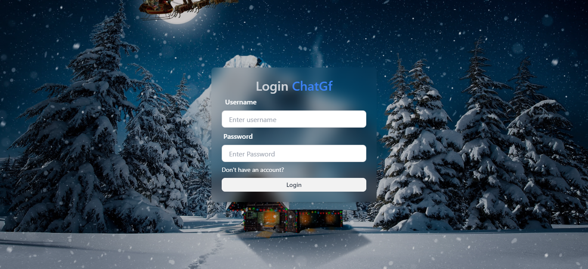

# ChatGf

ChatGf is a real-time chat application developed using ReactJs, Express, Socket.IO. It allows users to Sign Up or Log In and start chatting with other users in real-time. The project also utilizes Tailwind CSS and Daisy UI for styling, and MongoDB as the database to store users and their chats.

## Project

## Features

- User authentication: Users can sign up or log in to the application.
- Real-time messaging: Users can chat with each other after SignIn in real-time using Socket.IO.
- Responsive design: The application is responsive and works seamlessly across various devices.

## Technologies Used

- React: A JavaScript library for building user interfaces.
- Express: A fast, unopinionated, minimalist web framework for Node.js.
- Tailwind CSS: A utility-first CSS framework for rapidly building custom designs.
- Daisy UI: A Tailwind CSS component library for faster development.
- Socket.IO: A library that enables real-time, bidirectional, and event-based communication.
- MongoDB: A NoSQL database used to store user data and messages.
- Zustand: A state managemant library to manage the states similar to redux.

## Installation

1. **Clone the repository:**

   git clone <repository-url>
   cd <repository-folder>

2. Install server dependencies:

   npm install

3. Install client dependencies:

   cd ./frontend
   npm install

4. Create a .env file in the root of backend directory and add the following environment variables:

   PORT=
   MONGO_DB_URI=
   JWT_SECRET=
   NODE_ENV=

5. Start the backend and frontend servers:

   npm run dev

## Additional Information
- Make sure both the server and client are running simultaneously to use the full - - functionality of the application.
- Refer to the documentation or source code for any further customization or usage instructions.